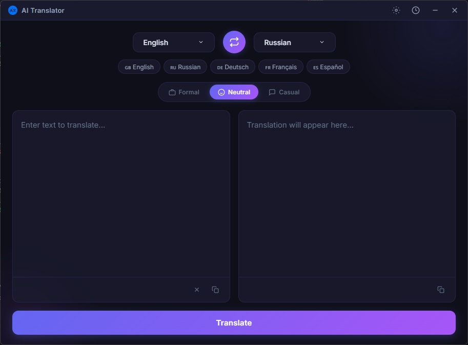

<div align="center">


# ✦ AI Translator

**Desktop Translator powered by Google Gemini AI**

*Fast, beautiful, and smart text translation supporting 30+ languages*

[](https://www.electronjs.org/)
[](https://ai.google.dev/)
[](LICENSE)

</div>

---

## 🌟 Features

- 🌍 **30+ Languages** — supports translation between English, Russian, German, French, Spanish, Ukrainian, Chinese, Japanese, Korean, Arabic, and many other languages
- 🎨 **Three Translation Styles** — choose between formal, neutral, and casual tones
- ⚡ **Instant Translation** — use `Ctrl+Enter` or the "Translate" button
- 🔥 **Google Gemini 2.5 Flash** — the fastest model for accurate translations
- 🔄 **Quick Language Swap** — the swap button instantly switches languages and text
- 📋 **Translation History** — automatically saves the last 100 translations
- ⌨️ **Global Hotkey** — summon the translator from any application (default `Ctrl+Shift+T`)
- 🔒 **System Tray** — runs in the background and is always at your fingertips
- 🎯 **Recent Languages** — quick access to frequently used languages

## 🖥️ Screenshots

<div align="center">

| Main Interface |
|:---:|
|  |

</div>

## 🚀 Installation

### Requirements

- [Node.js](https://nodejs.org/) 18+ 
- [Google Gemini](https://aistudio.google.com/apikey) API Key

### Steps

1. **Clone the repository:**

```bash
git clone https://github.com/pablosensei/ai-translator.git
cd ai-translator
```

2. **Install dependencies:**

```bash
npm install
```

3. **Run the application:**

```bash
npm start
```

4. **Configure your API Key:**
   - Click the ⚙️ icon in the top panel
   - Paste your Google Gemini API key
   - Click "Save Settings"

## 📖 Usage

### Basic Translation
1. Select source and target languages
2. Enter or paste text
3. Click **"Translate"** or press `Ctrl+Enter`

### Translation Style
Switch translation style with one click:

| Style | Description | Example |
|-------|-------------|---------|
| 💼 **Formal** | Business, professional tone | *"Dear colleagues, we are pleased to inform you..."* |
| 😊 **Neutral** | Standard translation | *"We are happy to announce..."* |
| 💬 **Casual** | Informal, friendly | *"Hey! Just wanted to let you know..."* |

### Global Hotkey
- Default: `Ctrl+Shift+T`
- Configurable in the ⚙️ Settings section

### History
- All translations are saved automatically
- Click an entry to use it again
- Click 🕐 to view your history

## 🛠️ Technologies

| Technology | Purpose |
|-----------|-----------|
| [Electron](https://www.electronjs.org/) | Desktop application |
| [Google Gemini AI](https://ai.google.dev/) | Translation engine |
| [electron-store](https://github.com/sindresorhus/electron-store) | Storing settings and history |
| HTML/CSS/JS | Interface |

## 📁 Project Structure

```
ai-translator/
├── main.js          # Main Electron process, Gemini API, IPC
├── preload.js       # Preload script, bridge between main and renderer
├── renderer.js      # UI logic, interface management
├── index.html       # Interface layout
├── styles.css       # Application styles
├── package.json     # Dependencies and metadata
└── README.md        # Documentation
```

## ⚙️ Configuration

Settings are stored locally via `electron-store`:

| Parameter | Description | Default |
|---------|----------|-------------|
| `apiKey` | Google Gemini API Key | — |
| `hotkey` | Global Hotkey | `Ctrl+Shift+T` |
| `windowBounds` | Window Size | `860×640` |
| `recentLanguages` | Recent Languages | `en, ru, de, fr, ...` |

## 🤝 Contributing

Contributions are welcome! Pull requests, bug reports, and suggestions are all welcome.

1. Fork the repository
2. Create a branch (`git checkout -b feature/amazing-feature`)
3. Commit your changes (`git commit -m 'Add amazing feature'`)
4. Push the branch (`git push origin feature/amazing-feature`)
5. Open a Pull Request

## 📄 License

This project is available for **non-commercial use only**. You may freely use, copy, and modify the code for personal, educational, and non-commercial purposes.

**For commercial use** — please contact the author: [GitHub](https://github.com/pablosensei).

Details are in the [LICENSE](LICENSE) file.

---
